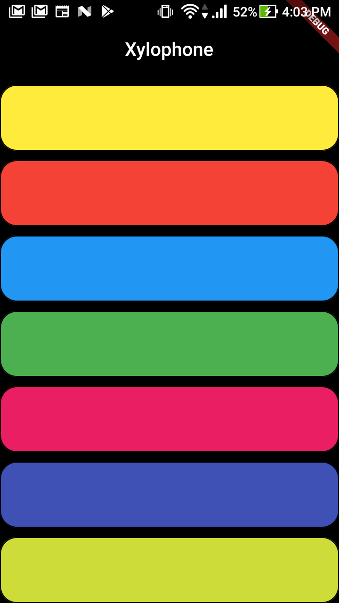

# flutter_xylophone

flutter plugins
- audioplayers

Create a rounded button / button with border-radius in Flutter
https://stackoverflow.com/questions/49991444/create-a-rounded-button-button-with-border-radius-in-flutter

1. Solution Summary
You can use shape for FlatButton and RaisedButton.

2. Rounded Button
shape: RoundedRectangleBorder(
  borderRadius: new BorderRadius.circular(18.0),
  side: BorderSide(color: Colors.red)
),
enter image description here

3. Square Button
shape: RoundedRectangleBorder(
  borderRadius: new BorderRadius.circular(0.0),
  side: BorderSide(color: Colors.red)
),
enter image description here

4. Complete Example
Row(
  mainAxisAlignment: MainAxisAlignment.end,
  children: <Widget>[
    FlatButton(
      shape: new RoundedRectangleBorder(
        borderRadius: new BorderRadius.circular(18.0),
        side: BorderSide(color: Colors.red)),
      color: Colors.white,
      textColor: Colors.red,
      padding: EdgeInsets.all(8.0),
      onPressed: () {},
      child: Text(
        "Add to Cart".toUpperCase(),
        style: TextStyle(
          fontSize: 14.0,
        ),
      ),
    ),
    SizedBox(width: 10),
    RaisedButton(
      shape: new RoundedRectangleBorder(
        borderRadius: new BorderRadius.circular(18.0),
        side: BorderSide(color: Colors.red)),
      onPressed: () {},
      color: Colors.red,
      textColor: Colors.white,
      child: Text("Buy now".toUpperCase(),
        style: TextStyle(fontSize: 14)),
    ),
  ],   
)
